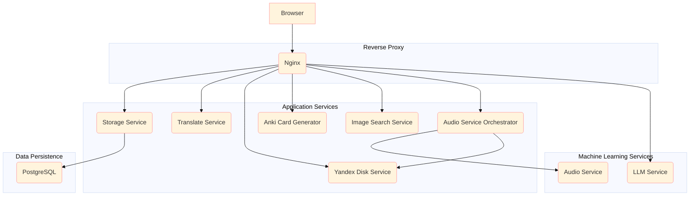

# Anki-Connect Spanish cards

A service allowing to generate language learning cards (Spanish to Russian, can be changed pretty easily) automatically.

# TODO

- [x] Ask for a deck to put generated cards to
- [ ] Use external LLM to generate questions for QA multi-choice card
- [ ] Avoid duplicates
- [ ] Improve generated questions refining

# Component diagram

# Demo

