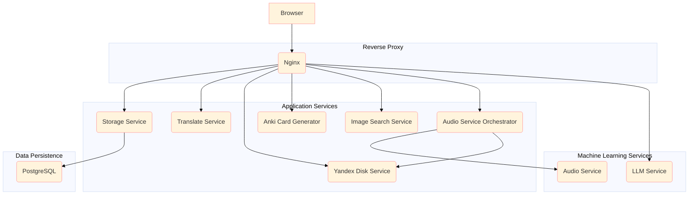

# Anki-Connect Spanish cards

It is a web-service allowing to generate language learning cards (Spanish to Russian, can be changed pretty easily) automatically:
1. A multi-choice QA card: single russian word, multiple spanish choices
2. A basic card with an audio on the front and spanish word or sentence on the back
3. A basic card and its reversed version with an image and spanish word on the front, and russian work on the back

Which gives in total 4 anki cards generated.
It calls Anki via Anki Connect to create new cards and to sync new card to AnkiWeb,
so after generating cards you can use it via any Anki client.

# Demo


# TODO

- [x] Ask for a deck to put generated cards to
- [ ] Use external LLM to generate questions for QA multi-choice card
- [ ] Avoid duplicates
- [ ] Improve generated questions refining

# System requirements

1. AnkiConnect plugin installed
2. Docker and compose
3. GPU with at least 12Gb VRAM

# Running

1. Run Anki with Anki Connect add-on enabled, make sure it uses port 8765
2. Run the rest of the system with Docker Compose:
```bash 
docker compose up
```
3. Wait for all service to become healthy (first run might take long)
4. Open https://localhost:8443/

## Running Anki as a background service

I use Ubuntu, and so can offer the following solution for Ubuntu users (might work for users of other Linux distributions:

1. Install [X Virtual Framebuffer](https://en.wikipedia.org/wiki/Xvfb):
```bash
sudo apt-get install -y xvfb
```
2. Register it as a Systemd service:
- use a [template](./anki-autoconnect.service)
- register a new service: 
```bash
  sudo cp anki-autoconnect.service /etc/systemd/system/
  # register a service
  sudo systemctl enable anki-autoconnect.service
  # start the service
  sudo systemctl start anki-autoconnect.service
  # check whether it is started or not
  sudo systemctl status anki-autoconnect.service
```

## Running AnkiLangCards as a service

1. Register it as a Systemd service:
- use a [template](./anki-lang-cards.service)
- register a new service: 
```bash
  sudo cp anki-lang-cards.service /etc/systemd/system/
  # register a service
  sudo systemctl enable anki-lang-cards.service
  # start the service
  sudo systemctl start anki-lang-cards.service
  # check whether it is started or not
  sudo systemctl status anki-lang-cards.service
```

# Component diagram


